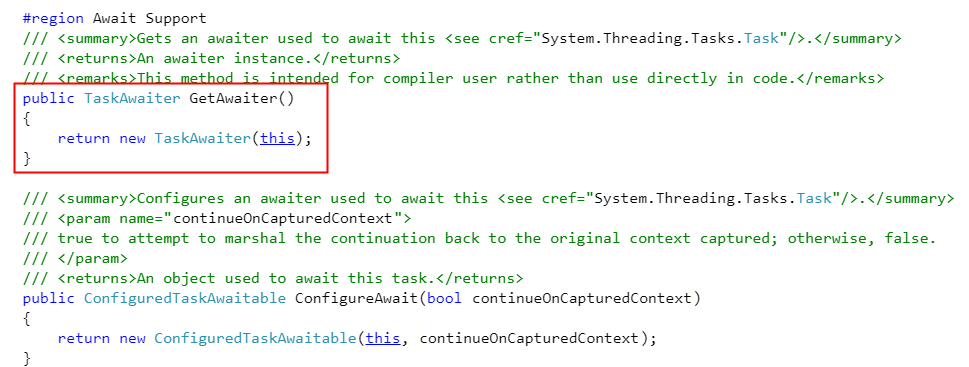
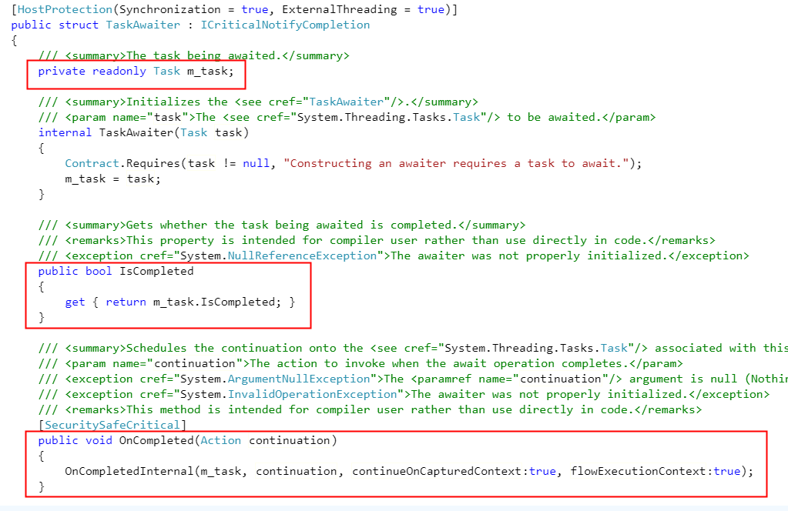
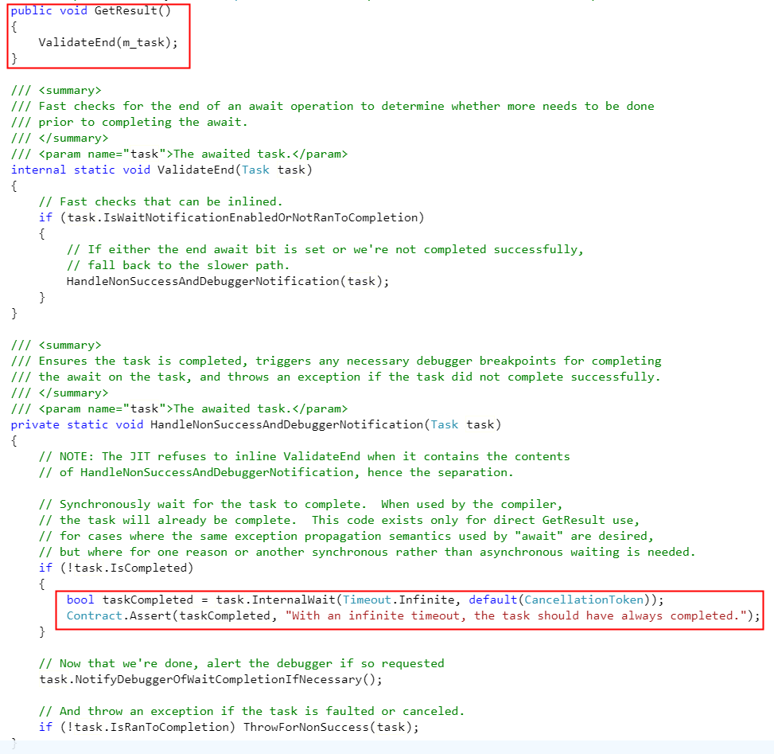

# 重新认识 async/await 语法糖

提起.Net中的 async/await，相信很多.neter 第一反应都会是异步编程，其本质是语法糖，但继续追查下去，既然是语法糖，那么经过编译之后，真正的代码是什么样的，如何执行的？带着这些疑问，通过网上资料的查询，可以了解到编译之后，是通过实现 IAsyncStateMachine 的一个状态机来实现的，博客园里大神Jeffcky 已经说得很清楚了，传送门： https://www.cnblogs.com/CreateMyself/p/5983208.html

上述知识对我们理解 async/await 非常重要，但不是本文讨论的侧重点，触发笔者写这篇文章的初衷是：

#### 1.只有Task可以被await吗，await之后就一定是异步执行吗？
答案当然不是，google了一圈后发现，当一个类可以被await，必须满足以下条件：

>a.它必须包含 GetAwaiter() 方法（实例方法或者<u>扩展方法</u>） // 扩展方法，手动划重点，聪明的你是不是立马有些思想火花
>b.GetAwaiter() 返回awatier实例，并且这个实例包含如下条件：
>
>>- 必须实现 INotifyCompletion 或者 ICriticalNotifyCompletion 接口
>>- 必须包含 IsCompleted 公共属性
>>- 必须包含 GetResult() 方法，返回void或者其他返回值

上述条件中INotifyCompletion 接口信息如下：

``` csharp
    //
    // 摘要:
    //     Represents an operation that schedules continuations when it completes.
    public interface INotifyCompletion
    {
        //
        // 摘要:
        //     Schedules the continuation action that&#39;s invoked when the instance completes.
        //
        // 参数:
        //   continuation:
        //     The action to invoke when the operation completes.
        //
        // 异常:
        //   T:System.ArgumentNullException:
        //     The continuation argument is null (Nothing in Visual Basic).
        void OnCompleted(Action continuation);
    }
```
重点上述对于参数 continuation 的解释：委托在操作完成之后调用。此处遗留一个问题：在谁的操作完成之后调用，是怎么调用的？

先把上述问题放一边，我们来自己写一个可以被await的类，并且观察前后执行的顺序以及是否存在线程切换：

```csharp
 public class Program {
        static async Task Main (string[] args) {
            Console.WriteLine ($"Begin awati,thread id is {Thread.CurrentThread.ManagedThreadId}");
            int result = await new CustomAwaitable ();
            Console.WriteLine ($"End await，result is {result},thread id is {Thread.CurrentThread.ManagedThreadId}");
            await Task.Delay (Timeout.Infinite);
        }
    }

    public class CustomAwaitable : INotifyCompletion {
        public void OnCompleted (Action continuation) {
            Console.WriteLine ($"Invoke continuation action on completed,thread id is {Thread.CurrentThread.ManagedThreadId}");
            continuation?.Invoke ();
        }

        public int GetResult () {
            Console.WriteLine ($"Get result,thread id is {Thread.CurrentThread.ManagedThreadId}");
            return 100;
        }

        public bool IsCompleted { get; set; }

        public CustomAwaitable GetAwaiter(){
            return this;
        }
    }
```
上述代码中，CustomAwaitable 实例满足了可被await的所有条件，并且正常通过编译，运行后发现结果如下：

```
PS D:\git\awaitable\src> dotnet run
Begin main,thread id is 1
Get awatier,thread id is 1
Begin Invoke continuation action on completed,thread id is 1
Get result,thread id is 1
End main，result is 100,thread id is 1
End Invoke
```

>根据上述日志，可以看出：
>1. **执行前后线程并未发生切换，所以当我们不假思索的回答 await/async 就是异步编程时，至少是一个不太严谨的答案**
>2. **最后执行日志 "End Invoke" 表明：continuation action 这个委托，根据上述调用日志顺序可以大致理解为：编译器将await之后的代码封装为这个 action，在实例完成后调用OnCompleted方法执行了await 之后的代码（注：实际情况比较复杂，如果有多行await，会转换为一个状态机，具体参看文章开头给出的连接）。**

#### 2.了解了上述知识之后，那么我们常规所说的await Task异步编程又是怎么回事呢？

1.  先来看Task部分源码([传送门](https://referencesource.microsoft.com/#mscorlib/system/threading/Tasks/Task.cs,9865ec4fb8abca74))：



上述红框代码显示，Task在GetAwaiter中创建了 TaskAwaiter对象，并将this传递。

2. 再来看TaskAwaiter源码([传送门](https://referencesource.microsoft.com/#mscorlib/system/runtime/compilerservices/TaskAwaiter.cs,16e40fc537484d93))：



看到此处，有了前面的知识，我们会对await task有了更加深入的理解：**Task通过增加一个GetAwatier()函数，同时将自身传递给TaskAwaiter类来实现了await语法糖的支持，同时在执行时，调用GetResult()函数的本质是通过 Task.Wait等待异步线程的执行完成，然后通过回调进行后续的操作。**

#### 总结
本文主要对 async/await 语法糖进行分析验证，同时通过对Task源码分析，更加深入的理解此语法糖本身的语法，相信通过通过此文，对大家从多个角度去理解异步编程有帮助，我自己也在不停的学习。

本文代码示例地址：https://github.com/xBoo/awaitable 
